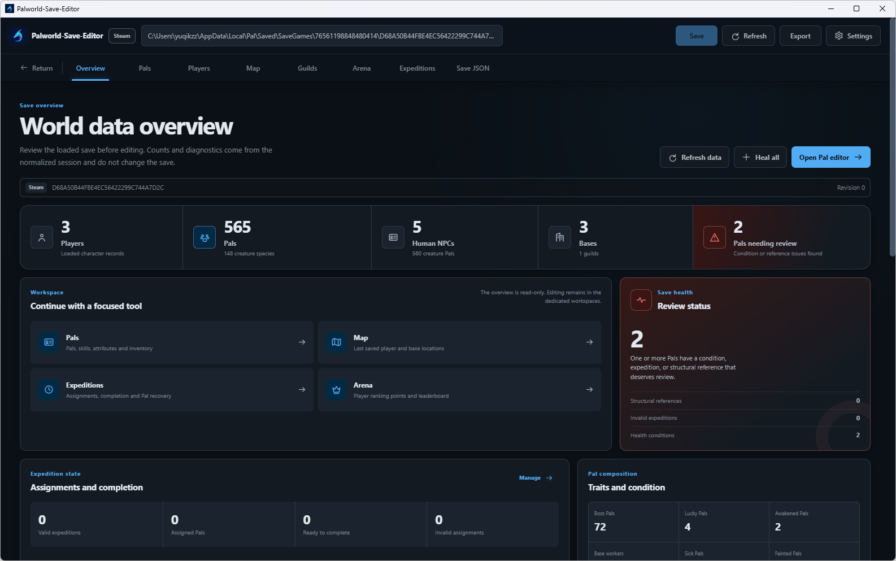
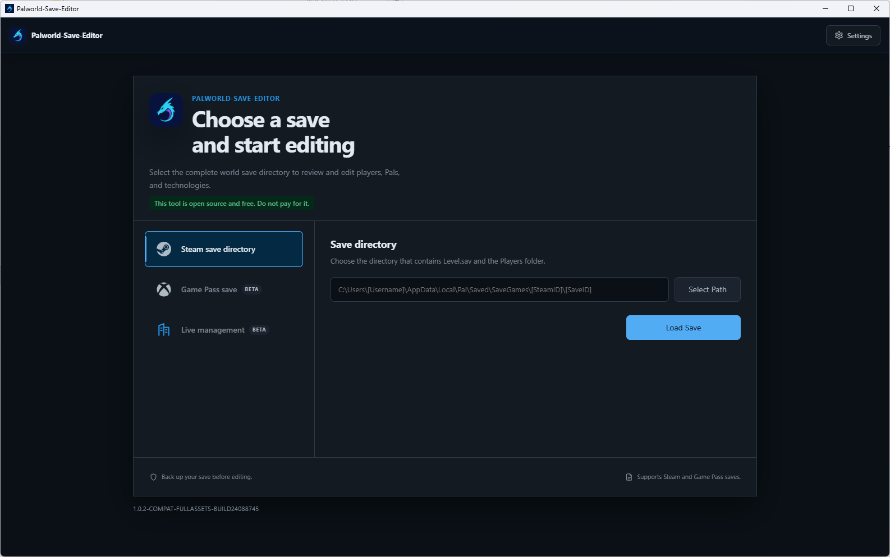
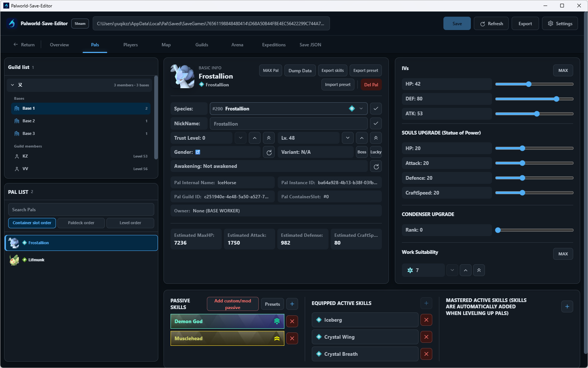
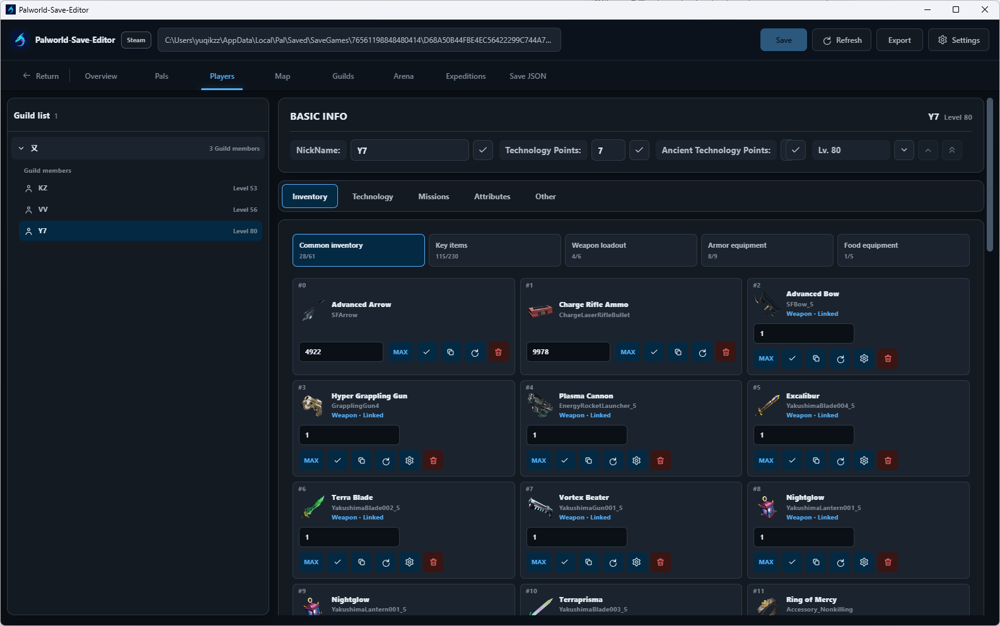
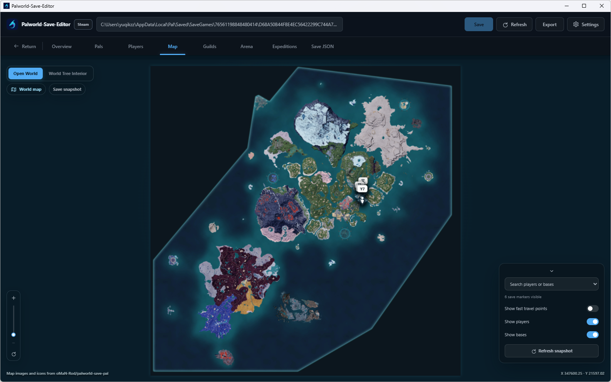
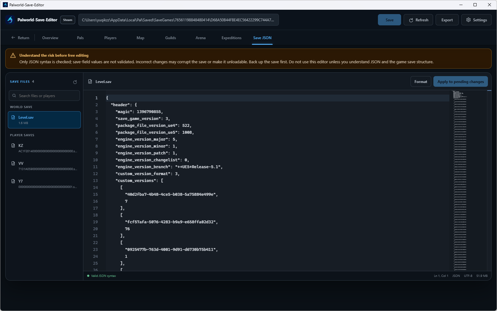
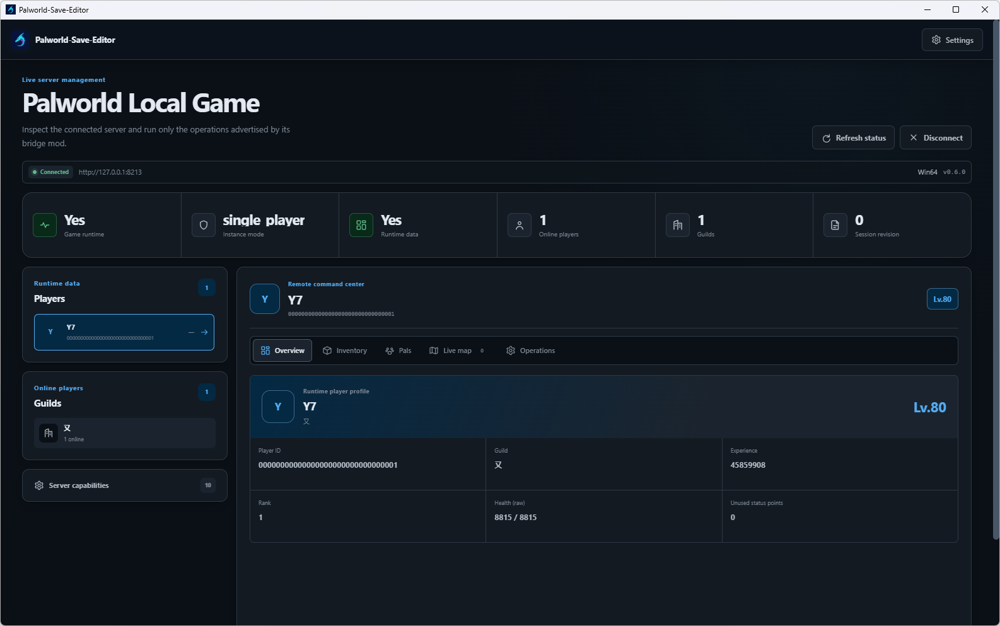
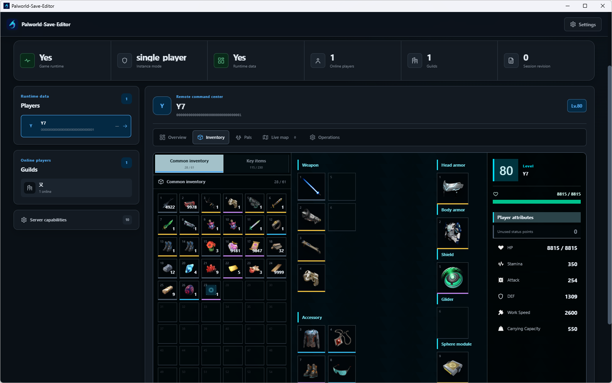
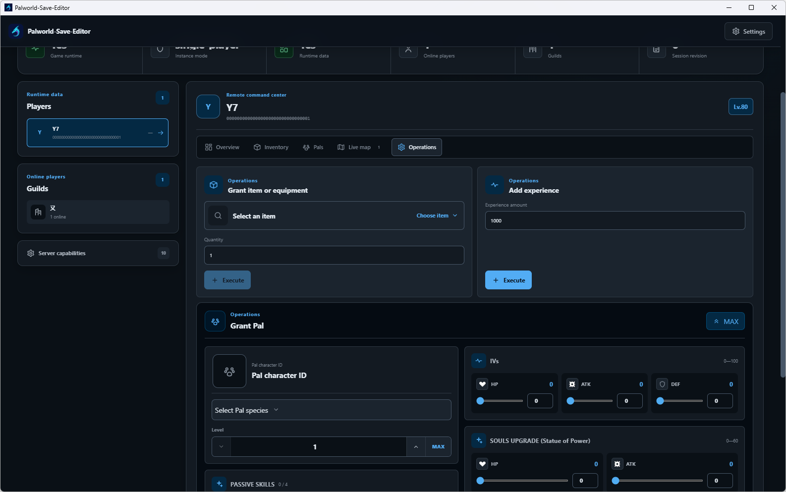

# Palworld-Save-Editor

<p align="center">
  
</p>

<p align="center">
  <a href="README.cn.md">简体中文</a> · <strong>English</strong>
</p>

<p align="center">
  <a href="https://github.com/xyuqikzz/Palworld-Save-Editor/releases/latest"><strong>Download</strong></a>
  · <a href="#features">Features</a>
  · <a href="#install-and-run">Install and run</a>
  · <a href="https://github.com/xyuqikzz/Palworld-Save-Editor/issues">Report an issue</a>
</p>

A local Palworld toolkit for offline Steam and Xbox Game Pass/WGS save editing, plus a separate capability-gated live management path for Windows Steam and PC Game Pass/XGP clients and dedicated servers. It provides a desktop GUI, Web UI, and interactive CLI. This project is a modified version based on [KrisCris/Palworld-Pal-Editor](https://github.com/KrisCris/Palworld-Pal-Editor) and remains licensed under GPL-3.0.

## Screenshots

<p align="center">
  
</p>

| Save source selection | Pal editing |
| --- | --- |
|  |  |

| Player and inventory editing | Interactive world map |
| --- | --- |
|  |  |

| Advanced save JSON | Live management overview |
| --- | --- |
|  |  |

| Live inventory | Capability-gated live operations |
| --- | --- |
|  |  |

Screenshots show the packaged Windows EXE with a local test save and a local single-player bridge session. Visible operations remain capability-gated and are not proof that every command has been verified for gameplay effect, replication, or persistence.

> [!WARNING]
> Exit the game or stop the server and make an offline copy of the entire world save directory before editing. The application creates backups during writes, but automatic backups are not a substitute for your own copy.

## Support scope

- Steam-format directories and locally selected Xbox Game Pass WGS folders are supported directly. Game Pass writes are locked to the opened slot and create a verified backup outside WGS first.
- Two-save migration can read Steam or WGS sources, but the current workflow only writes to a separate Steam-format target. Full-world and selected-character migration use analysis-bound plans, verified target backups, staging, conflict checks, atomic replacement, reopen validation, and verified recovery; WGS targets are explicitly blocked.
- Offline save editing and live management are separate workflows. Windows Steam and PC Game Pass/XGP clients and dedicated servers install PalEditorBridge through UE4SS. Only an authoritative single-player or listen-server host may connect; joined clients are rejected.
- Synthetic fixtures and a copied, user-authorized WGS sample have passed open, edit, commit, and reopen tests. Loading the result in the game and Xbox cloud synchronization have not been verified.
- The packaged EXE has connected to and displayed data from a local Windows Steam single-player session. XGP now has WinGDK process discovery and installation-path support, but real XGP gameplay effects, restart persistence, and Xbox cloud synchronization have not yet been verified. Each live command still requires its own in-game effect, client replication, save, restart, and reload verification; a successful protocol response alone is not sufficient.
- The current data and compatibility baseline targets Palworld 1.0 / Steam build 24088745.
- Unknown versions and unverified layouts are capability-gated. Do not force unsupported fields to be written.
- This is an unofficial community project and is not affiliated with Pocketpair.

Steam saves are normally stored under:

```text
%LOCALAPPDATA%\Pal\Saved\SaveGames\<Steam ID>\<World ID>
```

Select the complete world directory containing `Level.sav` and `Players/`, not an individual `.sav` file.

For Game Pass, exit Palworld and wait for local synchronization, then choose either the WGS root or the user directory containing `containers.index`. Read the slots and explicitly select the world to open. A successful local transaction does not prove Xbox cloud synchronization.

## Features

- Open a read-only world overview with player, Pal, species, base, guild, expedition, arena, condition, and structural-reference diagnostics.
- Browse players, Pals, guilds, bases, world containers, items, and last-saved map locations.
- Edit player names, levels, technology points, attributes, missions, and supported inventories.
- Edit item quantities and supported dynamic attributes; copy, move, replace, or clear slots; expand verified ordinary backpacks and guild chests without shrinking them.
- Inspect and edit verified persistent item storage for a selected guild base. Incomplete or ambiguous base-storage mappings remain read-only.
- Review the world-local arena leaderboard with the game build 24088745 NPC baseline, edit player RP, explicitly create a missing verified `ArenaRankPoint` field, or reset existing supported player records.
- Edit Pal species, variants, names, gender, trust, level, IVs, condensation, souls, work suitability, active skills, passive skills, custom/mod passive entries, and reusable presets.
- Add, duplicate, delete, and reorganize Pals across supported containers, with previews and reference checks for destructive operations; group player-owned Pals by Party, Palbox, and other locations with collapsible sections and container, Paldeck, or level sorting.
- Rename supported guilds, inspect role-sorted members, safely transfer Guild Master ownership on known layouts, increase verified Palbox levels and guild-chest capacities, and inspect bases, working Pals, skills, and conditions.
- Analyze two independent saves and perform full-world or selected-character migration into a Steam-format target, including supported player files, inventories, Party/Palbox data, and dimensional Pal storage. Unknown identities, opaque references, version mismatches, and changed sources or targets fail closed.
- Offer a narrowly scoped, backup-protected repair only when a failed save proves that valid guild-linked Pal records are missing their matching guild character handles; ambiguous or mixed structural damage remains blocked.
- Use the packaged open-world and World Tree maps to inspect players, guild bases, and verified fast-travel points; unlock supported player fast-travel flags, or explicitly clear or restore `LocalData.sav` fog-of-war masks.
- Review expedition assignments, quick-complete supported expeditions for normal in-game settlement, release Pals from invalid assignments, and run atomic Pal maintenance operations.
- Edit supported mission progress through preview tokens and explicit pending changes.
- Use the advanced Monaco JSON editor for `Level.sav` and `Players/*.sav`; only JSON syntax and supported document structure are checked, so incorrect values can still corrupt a save.
- Connect through PalEditorBridge to show online players first, then merge a short-lived read-only player snapshot by `PlayerUId`; filter all, online, and offline players and lazily inspect the selected player's profile, inventory, technology, missions, attributes, map progress, Party, and Palbox.
- Open the live-management map to combine authoritative online Pawn positions with last-saved offline player positions; every marker is labeled with the player's online or offline state, and invalid runtime levels fall back to the snapshot value.
- On dedicated servers, place kick, ban, and unban controls beside the selected player's level. These administrator actions send no optional reason, require a second confirmation, and are enabled only when the bridge has a verified REST `userId`; unban remains available for a player banned during the current connection.
- Expose authoritative mutations only for online targets and only when the current game build advertises them. The verified paths are granting an existing item, adding experience, and granting a Pal; unverified identity, slot replacement, mission/technology/fast-travel, and existing-Pal mutation paths remain explicitly disabled.
- Live mutations never write directly to an active `.sav` file and provide no rollback, undo, pre-change backup, or deferred offline queue. Successful changes coalesce a normal world save after two seconds, force one within ten seconds of continuous editing, and report `clean`, `dirty`, `saving`, or `failed` persistence state.
- Review revision-bound pending changes and save explicitly through temporary files, validation, verified backups, conflict detection, replacement, and reopen checks, preserving recovery information on failure. Windows save staging, Steam backups, and reopen verification support extended-length paths; paths that still exceed platform limits fail before save data is written and surface a specific recovery action.
- Use the UI in English, French, Japanese, Korean, or Simplified Chinese.

## Install and run

### Release builds

Download the archive or executable for your platform from [GitHub Releases](https://github.com/xyuqikzz/Palworld-Save-Editor/releases), extract it, and run the application.

Version-specific new features, bug fixes, and other changes are documented in GitHub Releases instead of this README.

### Live management on Windows

Live save management is separate from offline save editing and requires the Windows desktop EXE. Steam, PC Game Pass/XGP clients, and dedicated servers use their corresponding UE4SS directories:

1. Install a UE4SS release compatible with the current Palworld version: use `Win64` for Steam clients and Windows dedicated servers, or `Content\Pal\Binaries\WinGDK` for PC Game Pass/XGP clients.
2. On the source-selection screen, open **Live management**, download the bundled PalEditorBridge package, and copy its complete folder into the UE4SS `Mods` directory.
3. Enable the administrator REST API and configure its password in `PalWorldSettings.ini`.
4. Fully restart the game or server, connect from the editor, and use only capabilities reported by the bridge.

Do not expose Palworld or bridge ports directly to the public internet. Keep non-TLS access on loopback and place remote access behind an HTTPS reverse proxy. XGP live mutations use the game's normal authoritative and save paths; they do not rewrite an active WGS container directly. Verify every state-changing command separately in Steam and XGP before relying on it.

### Run from source

Python 3.11+ and a current Node.js LTS release are required.

```powershell
git clone https://github.com/xyuqikzz/Palworld-Save-Editor.git
cd Palworld-Save-Editor
.\setup_and_run.ps1 --lang en --mode gui
```

Linux/macOS:

```bash
git clone https://github.com/xyuqikzz/Palworld-Save-Editor.git
cd Palworld-Save-Editor
chmod +x setup_and_run.sh
./setup_and_run.sh --lang en --mode web
```

The setup scripts install the frontend and backend dependencies, build the Web UI, create a local virtual environment, and launch the application.

### Docker

Copy the sample Compose file, then update its ports, password, and save-directory mount:

```bash
cp docker/sample-docker-compose.yml docker-compose.yml
docker compose up -d
```

Never expose Web mode to the public internet without a strong password. The sample maps host port `8080`; consult the Compose file for the actual container port.

### Command-line options

```bash
python -m palworld_pal_editor --help
```

Common options:

| Option | Description |
| --- | --- |
| `--lang en|fr|ja|ko|zh-CN` | UI language |
| `--path <directory>` | World directory containing `Level.sav` |
| `--mode cli|gui|web` | Runtime mode |
| `--port <port>` | Web UI listening port |
| `--password <password>` | Web UI login password |
| `--nocli` | Disable the interactive CLI in GUI/Web mode |

Runtime settings are written to `config.json` beside the application. The file can contain local paths and Web settings and is ignored by Git.

## Development

The backend uses Python 3.11, Flask, and the bundled `palworld_save_tools`; the frontend uses Vue 3, Pinia, and Vite.

```powershell
# Python tests
.\venv\Scripts\python.exe -m pip install -e ".[dev]"
.\venv\Scripts\python.exe -m pytest -q

# Frontend tests and production build
cd frontend\palworld-pal-editor-webui
npm ci
npm test
npm run build
```

Real-save tests never use committed binary fixtures or modify their source files. See [`tests/fixtures/real_saves/README.md`](tests/fixtures/real_saves/README.md) for local setup. Local `.sav`, `.gvas`, and `manifest.local.json` files are ignored by Git.

## Issues and contributions

Search [existing issues](https://github.com/xyuqikzz/Palworld-Save-Editor/issues) before reporting a problem. Include the editor version, game version, reproduction steps, and sanitized logs. Save files may contain player identifiers and other private data; inspect and sanitize them before uploading publicly.

For code contributions, branch from the latest `develop` branch and describe the change scope and commands actually used for verification in the pull request.

## License and attribution

The project is distributed under the [GNU GPL v3](LICENSE). See [NOTICE.md](NOTICE.md) for the derivative-work notice and [THIRD_PARTY_LICENSES](THIRD_PARTY_LICENSES) for bundled or derived third-party components.

Thanks to the upstream maintainers, `palworld-save-tools`, PalEdit, and all translation and testing contributors. Their applicable copyright and license notices are preserved in this repository.
